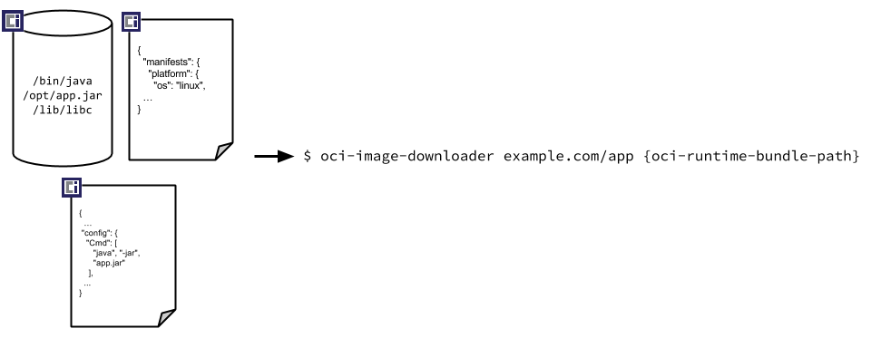
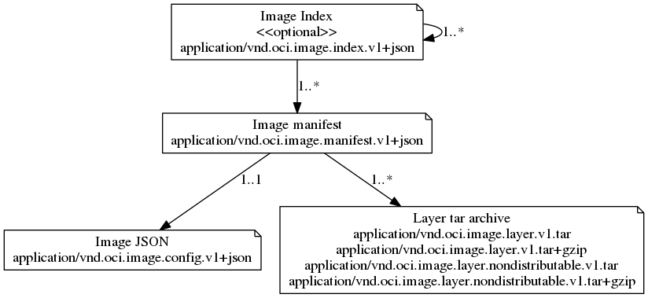

# IMAGE
- OCI image spec [spec.md]
- docker image spec
- Kaniko

## overview
At a high level the image manifest contains metadata about the contents and dependencies of the image including the content-addressable identity of one or more [filesystem layer changeset](layer.md) archives that will be unpacked to make up the final runnable filesystem.


Once built the OCI Image can then be discovered by name, downloaded, verified by hash, trusted through a signature, and unpacked into an [OCI Runtime Bundle](https://github.com/opencontainers/runtime-spec/blob/master/bundle.md).



The high-level components of the spec include:

* [Image Layout](image-layout.md) - a filesystem layout representing the contents of an image
* [Image Index](image-index.md) - an annotated index of image manifests
* [Image Manifest](manifest.md) - a document describing the components that make up a container image
* [Filesystem Layer](layer.md) - a changeset that describes a container's filesystem
* [Image Configuration](config.md) - a document determining layer ordering and configuration of the image suitable for translation into a [runtime bundle][runtime-spec]
* [Conversion](conversion.md) - a document describing how this translation should occur
* [Descriptor](descriptor.md) - a reference that describes the type, metadata and content address of referenced content

The following figure shows how the above media types reference each other:



## image layout

The OCI Image Layout is directory structure for OCI content-addressable blobs and location-addressable references (refs).
- blobs directory
- oci-layout file
- index.json file

## image index

The image index is a higher-level manifest which points to specific image manifests, ideal for one or more platforms.

### Example Image Index

*Example showing a simple image index pointing to image manifests for two platforms:*
```json,title=Image%20Index&mediatype=application/vnd.oci.image.index.v1%2Bjson
{
  "schemaVersion": 2,
  "manifests": [
    {
      "mediaType": "application/vnd.oci.image.manifest.v1+json",
      "size": 7143,
      "digest": "sha256:e692418e4cbaf90ca69d05a66403747baa33ee08806650b51fab815ad7fc331f",
      "platform": {
        "architecture": "ppc64le",
        "os": "linux"
      }
    },
    {
      "mediaType": "application/vnd.oci.image.manifest.v1+json",
      "size": 7682,
      "digest": "sha256:5b0bcabd1ed22e9fb1310cf6c2dec7cdef19f0ad69efa1f392e94a4333501270",
      "platform": {
        "architecture": "amd64",
        "os": "linux"
      }
    }
  ],
  "annotations": {
    "com.example.key1": "value1",
    "com.example.key2": "value2"
  }
}
```

## Image Manifest
- Content-addressable images
- Multi-architecture images
- OCI Runtime Specification

### Example Image Manifest

*Example showing an image manifest:*
```json,title=Manifest&mediatype=application/vnd.oci.image.manifest.v1%2Bjson
{
  "schemaVersion": 2,
  "config": {
    "mediaType": "application/vnd.oci.image.config.v1+json",
    "size": 7023,
    "digest": "sha256:b5b2b2c507a0944348e0303114d8d93aaaa081732b86451d9bce1f432a537bc7"
  },
  "layers": [
    {
      "mediaType": "application/vnd.oci.image.layer.v1.tar+gzip",
      "size": 32654,
      "digest": "sha256:9834876dcfb05cb167a5c24953eba58c4ac89b1adf57f28f2f9d09af107ee8f0"
    },
    {
      "mediaType": "application/vnd.oci.image.layer.v1.tar+gzip",
      "size": 16724,
      "digest": "sha256:3c3a4604a545cdc127456d94e421cd355bca5b528f4a9c1905b15da2eb4a4c6b"
    },
    {
      "mediaType": "application/vnd.oci.image.layer.v1.tar+gzip",
      "size": 73109,
      "digest": "sha256:ec4b8955958665577945c89419d1af06b5f7636b4ac3da7f12184802ad867736"
    }
  ],
  "annotations": {
    "com.example.key1": "value1",
    "com.example.key2": "value2"
  }
}
```
## Image Layer
[Filesystem Layer](layer.md) - a changeset that describes a container's filesystem

## Image Config

- Layer
- Image json
- DifferID
- ChainID
- ImageID

## docker image
[docker image spec](https://github.com/moby/moby/blob/master/image/spec/v1.2.md)


/var/lib/docker/image/overlay2

## kaniko
[kaniko](https://github.com/GoogleContainerTools/kaniko)
